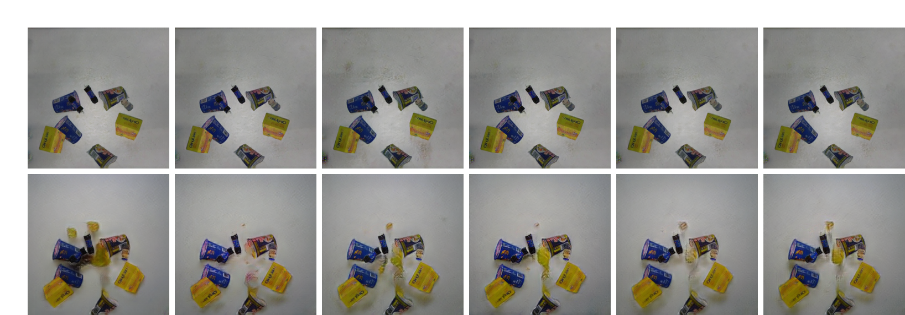

# 复现实验

记录实验过程：思路，实现方法，问题，解决/未解决。

四个基线实验中，第一个实验直接使用单个商品图像数据来训练，这个在数据集中直接有，而第四个实验是基于2，3实验来完成的，所以要处理的是实验2，3中所需数据的获取。

## 分割

首先第一步要从单个商品图像中将商品目标分割出来，大致可分为以下几步：

1. 利用所给信息对单个商品图像进行bounding box的标注并以此进行剪裁（当然实际操作可以直接剪裁），分别剪裁出一倍和两倍bounding box大小的图像。
2. 对两倍bounding box大小的图像用显著性检测，将前后景区分开来。
3. 将2.中的结果与一倍bounding box大小的图像一起通过CRF进行细化处理，再将其按照一倍bounding box大小进行剪裁，得到最后的mask。
4. 将3.中得到的mask再与一倍bounding box大小的图像一起结合抠出目标图像，最后将黑色背景透明化处理即可。

下图是一个实现流程草图（展示图是我得出的效果）：

具体的实现过程：

1. 这一步的剪裁没有什么问题，需要注意的是因为拍摄位置关系有的商品图像的两倍bounding box区域会超出原图，这时候以边界为准进行剪裁即可，同时记录一下剪裁位置，方便对之后CRF得到的MASK进行剪裁。当然，二倍bounding box剪裁的作用在于为显著性检测提供前后景的上下文内容，所以如果进行二倍bounding box剪裁的时候超出原图范围也可以少剪裁一些，这样之后对MASK进行剪裁的时候只需要有bounding box大小的数据即可。
2. 关于显著性检测的方法，论文中提及了使用 [Detecting salient
   objects via color and texture compactness hypotheses](<https://ieeexplore.ieee.org/abstract/document/7523421>)中的方法来获取初步的MASK，由于这篇论文未公布代码，所以我借鉴另一个[显著性检测](<https://github.com/Joker316701882/Salient-Object-Detection>)的方法来实现，关于显著性检测这部分的研究是有挺多的。我的得到的效果由于目标颜色与背景颜色相似程度以及光亮相似程度使得分割出的MASK会或多或少一些，这样的状况在论文中也有体现，初步MASK的生成会直接影响最后分割出商品效果的完整度，对之后的检测有多少影响这个就需要实验来验证了，主观的猜测应该还是蛮有影响的，因为之后如果要实际应用的话抠出来的商品MASK越接近真实商品肯定是越好的。我现在使用的是预训练好的模型来进行显著性检测，如果能够用需要检测的的同类型进行训练，那模型大概率能得到更好的MASK图，但是这样就需要真实MASK图来进行训练，这一步的成本消耗较高，比较麻烦。
3. 关于CRF的方法，论文中提及了使用[Efficient inference in fully
   connected CRFs with Gaussian edge potentials](<http://papers.nips.cc/paper/4296-efficient-inference-in-fully-connected-crfs-with-gaussian-edge-potentials.pdf>)中的方法来对2.中生成的初步MASK图进行细化处理，同样由于论文没有提供源码，我借鉴了[CRF](<https://github.com/Andrew-Qibin/dss_crf>)的方法来实现，可以将初步MASK中边缘模糊的内容变得清晰化，这个对MASK图的边缘细化效果很好，但是如果MASK图本身是有缺失的，那CRF这样的处理会使得缺失增大，当然处理这个问题最直接的还是改善显著性检测得到MASK图的质量。
4. 这一步是将同为一倍bounding box大小的的商品图和MASK图进行一个累加，对MASK部分进行填充，之后再将背景中的黑色部分透明化处理即可。

下图是论文中实现的一个例子(左侧方框)，以相同的原图我所得到的效果(方框右侧)：

放上来的这份[code](segment/segment_product.py)是一次一张图来处理的完整流程，如果硬件允许的话使用多进程会高效很多（我的设备是i3-8100+1070处理一张图的时间在4.4秒左右，跑完所有的图要65小时）。

## 合成

分割出商品图之后，需要将其复制，黏贴到准备好的的背景图中。每个背景图要黏贴多少个商品图将按照之前对不同复杂等级的设计标准来制定，黏贴什么商品以及黏贴的位置和角度则是完全随机的，有一个约束是商品之间的遮挡率要小于0.5，以此来使得合成的图像尽可能接近于真实的结账图像。

下图是合成一张商品结算图像的过程演示：

具体的实现过程：

1. 有些商品的拍摄角度在从背景中分割出来之后放置到背景中会和真实的结算台摆放的商品效果有些突兀，这种状况在加上一定旋转角度之后尤为明显，当然一个拍摄角度的图像加上旋转之后可能就变成了另一个拍摄角度的图像。这个在后期确定真实结算台拍摄方法（一般来说是正上方俯拍）之后可以对要粘贴的商品图进行一定条件的筛选，这样合成的图可以更加接近真实结算台的效果。

2. 关于遮挡率。一开始直接用IoU值来进行判断，发现在面对大小差异较大的两个商品时IoU不能反映出真实遮挡情况（大小差距过大时，哪怕小商品在大商品内IoU数值也较小），并且如果只比较两件商品的情况就可能发生每一件商品对某一个商品遮盖都不多，但是实际上这个商品被遮盖部分已经超出了阈值，所以采用了一种用数值矩阵来记录商品被遮盖的情况，1表示未遮挡，0表示被遮挡，下图是一个简单的演示：

   

同样放上来的这份[code](synthesize/synthesize_product.py)是一次合成一张图的完整流程，如果硬件允许的话使用多进程会高效很多，合成的时间取决于要黏贴的图像数量，少则几毫秒多则几秒。

## 渲染

合成的商品结算图像和真实的之间存在光影效果的缺失，论文提出用CycleGAN([Project](<https://github.com/junyanz/pytorch-CycleGAN-and-pix2pix>)，[Paper](<https://arxiv.org/pdf/1703.10593.pdf>))来进行渲染添加光影效果，对两个域进行转换。对于风格转换来说，两个域之间的转换需要训练相对应的网络模型来实现，因此需要多次实验来调整训练以实现网络模型能生成预计效果。

| 实验:名称\数据参数 | 数据:大小,背景,旋转,位置匹配,数据对齐, | batch_size | result                                                       |
| ------------------ | -------------------------------------- | ---------- | ------------------------------------------------------------ |
| 1:rpc_cyclegan     | 1K,1,N,N,N                             | 2          | 商品失真，位置变动，噪声较多，有阴影效果                     |
| 2:rpc_pix2pix      | 2k,1,N,N,Y                             | 2          | 采用配对数据理论上可以获得更好的效果，但结果与1相似并未得到改善 |
| 3:vs1000           | 1K,1,N,Y,N                             | 8          | 对商品摆放的位置按照目标域图像相同设置，位置不变动，失真和噪声仍存在，有阴影效果 |
| 4:vs2000           | 2k,1,Y,Y,N                             | 8          | 增加数据量，相较于3在失真和噪声方面有所改善                  |
| 5:v1000            | 1K,2,Y,Y,N                             | 8          | 发现噪声出现集中在背景高亮部分，想更换背景，采用和目标域相同分布的背景图进行实验 |
| 6:v2000            | 2k,2,Y,Y,N                             | 8          | 6之于5有类似4之于3的效果提升，但是噪声的问题没有得到改善，发现一个现象背景2合成的数据集训练好的模型去测试背景1合成的数据几乎没有变化效果，反之亦然 |
| 7:v4000            | 4k,2,Y,Y,N                             | 8          | 继续增加数据集大小进行训练，相较于5，6的结果在纹理，光影以及噪声三个方面的效果并未有明显改善。 |
| 7:test8000         | 8k,2,Y,Y,N                             | 8          | TODO                                                         |

实验1效果：

实验2效果：

实验3和4对比效果：

​	横轴的数字代表模型训练epoch的数量，最后一列是原域(上)和目标域(下)图，纵轴表示的是训练数据集大小

实验5和6对比效果：

用背景1合成的数据训练的模型来测试背景1和背景2合成的两种数据：

用背景2合成的数据训练的模型来测试背景1和背景2合成的两种数据：

实验7：

用背景2合成的数据训练的模型来测试背景1（上）和背景2（下）合成的两种数据：

​	从左至右依次是训练迭代次数为150，160，170，180，190，200时的测试效果

